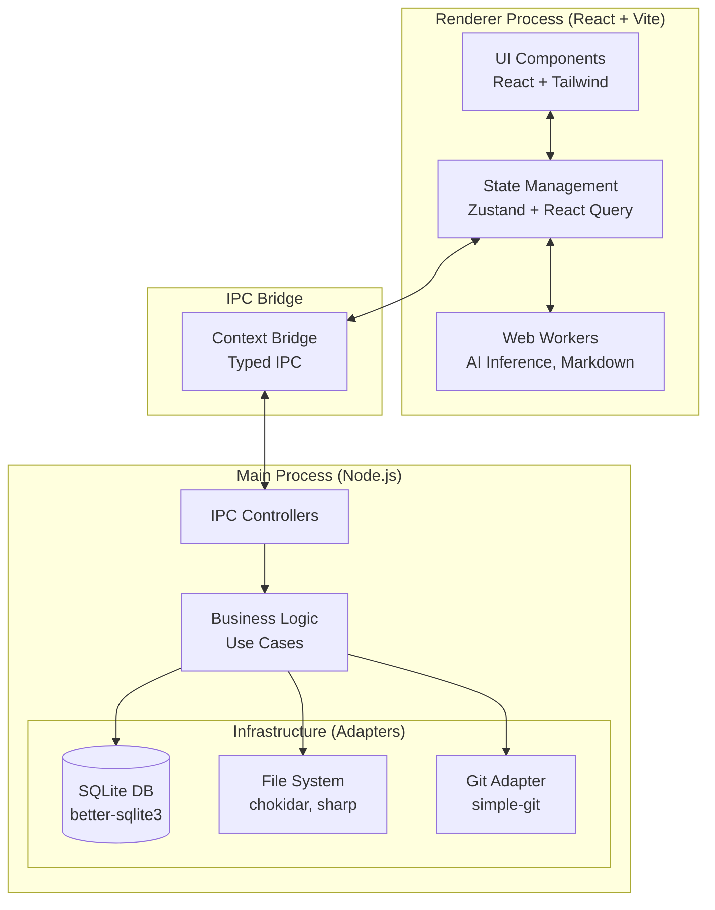

# 🧠 Memoriser (Mneme)

Memoriser is a modern, high-performance note-taking and knowledge management application built with Electron and React. Designed for students, researchers, and developers, it bridges the gap between local markdown files, Git-backed version control, and advanced AI capabilities (both local and cloud).


## ✨ Features

- **Rich Markdown Editor:** Built with CodeMirror and React, supporting KaTeX, frontmatter, and seamless image handling.
- **Local AI Inference:** Powered by `@huggingface/transformers` running in a dedicated Web Worker. Generate summaries and tags without data leaving your machine.
- **Git & GitHub Integration:** Automatically tracks your vault history. Push changes to GitHub and automatically deploy a static site using MkDocs.
- **Flashcard System:** Built-in spaced repetition system directly integrated into your notes.
- **Full-Text Search (FTS5):** Lightning-fast search across your entire vault using SQLite's FTS5 engine.
- **File System Watcher:** Real-time synchronization with your local vault directory. Edit files in any editor, and Memoriser instantly updates.
- **Privacy-First Vault:** All your notes are stored locally as plain Markdown files. You own your data.

---

## 🏗️ Architecture

Memoriser uses a modern Electron stack, treating the Main process as a robust backend (Hexagonal Architecture) and the Renderer as a lightweight, reactive frontend.



### Key Components

1. **Frontend (Renderer):** 
   - **React & TailwindCSS** for a responsive, accessible UI.
   - **TanStack React Query** manages "Server State" (data from the Main process).
   - **Zustand** manages local UI state (modals, active tabs).
   - **Web Workers** run `@huggingface/transformers` to offload heavy AI computation from the main UI thread.

2. **Backend (Main):**
   - **Hexagonal Architecture:** Business logic is decoupled from infrastructure. 
   - **Better-SQLite3:** Provides a robust local database for metadata, FTS5 search indexing, and flashcard scheduling.
   - **Chokidar:** Watches the local vault directory for external changes and syncs the database.

3. **IPC Bridge:**
   - A strictly typed IPC (Inter-Process Communication) layer ensures type safety between the frontend and backend.

---

## 🚀 Getting Started

### Prerequisites
- Node.js (v18+)
- Python 3 (Optional, for MkDocs live preview)

### Installation

1. **Clone the repository:**
   ```bash
   git clone https://github.com/Vikramadtya/Mneme.git
   cd Mneme
   ```

2. **Install dependencies:**
   ```bash
   npm install
   ```

3. **Start the development server:**
   ```bash
   npm run dev
   # or concurrently start Vite and Electron
   npm run electron:dev
   ```

### Building for Production

To build the macOS application (`.dmg` and `.app`):

```bash
make build-prod
# or using npm
npm run build:mac
```
The packaged application will be available in the `release/` directory.

---

## 🛠️ Developer Guide (Onboarding)

### Directory Structure

- `src/` - The React Renderer application. Follows Feature-Sliced Design (FSD) principles.
- `electron/` - The Node.js Main process. Implements a layered architecture.
- `docs/` - Source code for the static landing page.

### Debugging & Logs
- **Main Process Logs:** Logs are stored at `~/Library/Logs/Memoriser/main.log` (on macOS).
- **Renderer Logs:** Open the Chrome DevTools (`Cmd+Option+I` or `View > Toggle Developer Tools`) inside the app.

### Common Workflows

- **Adding a new DB Table:** 
  Modify `electron/db/migrations.ts` to add a new migration. Define the new TypeScript interfaces in `src/domain/models/index.ts`.
- **Adding a new IPC Call:**
  1. Define the signature in `src/types/ipc.ts`.
  2. Implement the backend handler in `electron/ipc/` (or `electron/handlers/`).
  3. Create a React Query wrapper in `src/shared/api/ipcClient.ts`.
- **Testing AI Features:**
  The local AI models (via Transformers.js) are downloaded on first use. Ensure you have an active internet connection the first time you generate a summary.

---

## 📄 License

MIT License. See `LICENSE` for details.
