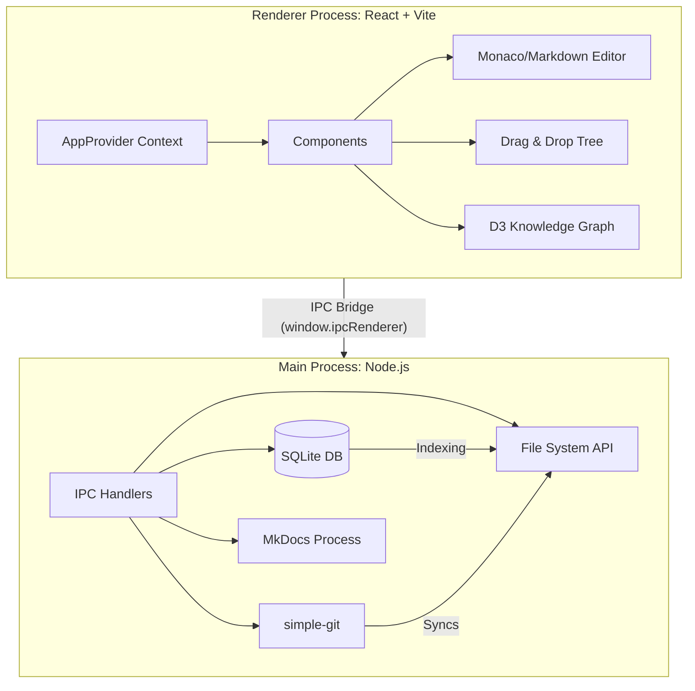

# Memoriser

Memoriser is a modern, high-performance desktop application built with Electron, React, and SQLite. It serves as an offline-first, Git-synced knowledge base and spaced-repetition learning platform. The app is tailored for students, professionals, and lifelong learners who want to organize their knowledge into "Books" and "Courses", take Markdown-based notes, and retain that knowledge through embedded flashcards.

## Table of Contents
1. [Core Philosophy](#core-philosophy)
2. [Application Architecture](#application-architecture)
3. [Key Features](#key-features)
4. [Data Flow & State Management](#data-flow--state-management)
5. [Feature Deep-Dive](#feature-deep-dive)
    - [Vault System](#vault-system)
    - [Books & Courses Structure](#books--courses-structure)
    - [Note Editing & Markdown](#note-editing--markdown)
    - [Spaced Repetition Flashcards](#spaced-repetition-flashcards)
    - [Git Sync & Deployment](#git-sync--deployment)
    - [Go Live (MkDocs Integration)](#go-live-mkdocs-integration)
6. [Configuration & Files](#configuration--files)
7. [Developer Guide](#developer-guide)

---

## Core Philosophy

- **Local-First & Offline-Ready**: Your data lives on your machine as plain Markdown files. There is no cloud lock-in. SQLite acts purely as an indexing layer for rapid search and relation tracking.
- **Git-Backed**: Every save triggers an atomic write and an optional Git commit, ensuring absolute version history and seamless remote synchronization.
- **Structured Knowledge**: Instead of a flat folder of notes, Memoriser enforces a hierarchical structure (Books → Chapters → Notes, or Courses → Modules → Notes) that mirrors structured learning.
- **Active Recall**: Flashcards are embedded directly within notes. The app automatically extracts them and schedules them using the SM-2 spaced repetition algorithm.

---

## Application Architecture

Memoriser uses a dual-process architecture inherent to Electron applications.

1. **Renderer Process (Frontend)**: Built with React, Vite, and Tailwind CSS. It handles all UI rendering, Markdown parsing (via `react-markdown`), and user interactions. State is managed via a centralized Context provider (`AppProvider.tsx`).
2. **Main Process (Backend)**: Built with Node.js. It manages the application window, interfaces with the OS file system via `fs/promises`, runs the SQLite database using `better-sqlite3`, and spawns shell commands for Git and MkDocs.

---

## Key Features

- **Split-Pane UI**: Adjustable layout with Left Sidebar (Navigation), Main Editor (Markdown), and Right Sidebar (Flashcard creation/metadata).
- **Spatial Canvas**: (Removed in recent versions for optimization, previously used for visual node tracking).
- **Knowledge Graph**: A D3.js-powered visual representation of connections between Books, Chapters, and Notes.
- **Embedded PDF Viewer**: Read source material directly inside the app while taking notes alongside it.
- **Spaced Repetition System (SRS)**: Create flashcards linked to specific notes and review them daily to build long-term memory.
- **One-Click Publishing**: Instantly publish your vault to GitHub Pages using MkDocs Material.

---

## Data Flow & State Management

### 1. Initialization Flow
When the app launches, it asks the user to select a "Vault" (a directory on their disk). 
- `AppProvider` mounts and calls `ipc.getVaultPath()`.
- The Main process reads the saved path from `config.json`.
- The Frontend requests the initial state: `ipc.getProjects()`, `ipc.getNotes()`, `ipc.getSettings()`.
- The Main process queries SQLite and returns the data, hydrating the React state.

### 2. Save Flow
- The user edits a note. `AppProvider` holds the draft in `newNoteContent`.
- The user hits `Cmd+S` or clicks Save.
- The Frontend calls `ipc.saveNote(vaultPath, noteObject)`.
- The Main process:
  1. Opens an SQLite transaction.
  2. Updates the `notes` and `flashcards` tables.
  3. Uses `atomicWrite` to write the Markdown file to the disk (e.g., `/Vault/Book Name/Chapter 1/Note.md`).
  4. Spawns `git add` and `git commit` via `simple-git`.
  5. Commits the SQLite transaction.
- The Frontend re-fetches the updated data.

---

## Feature Deep-Dive

### Vault System
The Vault is the root directory containing all your data. 
- **File Structure**: Memoriser maps its internal SQLite `Project` entities directly to folders on the disk.
- **Source of Truth**: The Markdown files are the ultimate source of truth. SQLite is an index. If the SQLite DB is deleted, it can be theoretically rebuilt from the Markdown files (a feature planned for future architectural phases).

### Books & Courses Structure
The sidebar separates knowledge into:
- **Books**: Contain `Chapters`. Chapters contain `Notes`.
- **Courses**: Contain `Modules`. Modules contain `Notes`.
This enforced hierarchy ensures that loose notes do not pile up aimlessly. The `LeftSidebar.tsx` uses `@dnd-kit/core` to allow drag-and-drop reorganization of these structures.

### Note Editing & Markdown
The main editing surface leverages `react-markdown` with plugins like `remark-gfm` (tables, checklists) and `rehype-raw` (HTML support). 
- **Auto-Linking**: When a user types `[[Note Title]]`, the system parses this and generates an internal link. Clicking it dispatches an action to open the referenced note.

### Spaced Repetition Flashcards
Flashcards are stored in the SQLite `flashcards` table and are linked to a `note_id`.
- **Algorithm**: When a user reviews a card in the `FlashcardReview.tsx` modal, they grade it (Hard, Good, Easy). The app calculates the `easeFactor`, `interval`, and `nextReviewDate` based on the SM-2 algorithm.
- **Daily Goals**: The user sets a `dailyGoal` (e.g., 20 cards/day). The `ReviewContext` tracks completion and displays a progress bar.

### Git Sync & Deployment
Memoriser treats the Vault as a Git repository.
- **Auto-Commit**: Enabled via Settings, every file change generates an automatic commit message (`Updated Note: [Title]`).
- **History Viewer**: `VaultHistoryModal.tsx` parses `git log` to show a timeline of changes. Users can click "Restore" to check out an older version of a note, providing a time-machine capability.

### Go Live (MkDocs Integration)
The "Go Live" feature converts the user's local Markdown vault into a beautiful static website using MkDocs Material.
- **Configuration**: The app manages a `mkdocs.yml` file in the root of the vault.
- **Live Preview**: `ipcMain.handle("app:startMkdocs")` spawns a child process (`mkdocs serve`) and streams the output to the frontend. The user can view the site locally on port `8000`.
- **GitHub Actions**: If configured, the app writes a `.github/workflows/mkdocs.yml` file. Pushing to GitHub triggers the Action, deploying the site to GitHub Pages automatically.

---

## Configuration & Files

Memoriser relies on several configuration files and structures to maintain state and settings.

### 1. The OS AppData Directory
Located at `~/Library/Application Support/Memoriser` (macOS) or `%APPDATA%\Memoriser` (Windows).
- `config.json`: Stores the absolute path to the user's currently selected Vault directory.
- `memoriser.db`: The SQLite database. Contains tables for `projects`, `notes`, `flashcards`, `activity_logs`, `schema_migrations`, and `settings`.

### 2. The Vault Directory
Located wherever the user selected (e.g., `~/Documents/MyVault`).
- `mkdocs.yml`: The configuration file for the static site generator. Memoriser programmatically updates the `site_name` and navigation structure.
- `docs/`: The root directory for MkDocs where all Markdown files are saved.
- `docs/assets/`: Stores images and PDFs uploaded via the app.
- `.github/workflows/`: Stores the deployment script for GitHub Pages.

---

## Developer Guide

### Prerequisites
- Node.js (v18+)
- npm (v9+)
- Python 3 & pip (for MkDocs functionality)

### Tech Stack
- **Frontend**: React 18, Vite, Tailwind CSS, Lucide React (Icons), DND Kit (Drag and Drop).
- **Backend**: Electron, Node.js, better-sqlite3, simple-git.

### Running Locally
1. Clone the repository.
2. Run \`npm install\` to install dependencies.
3. Run \`npm run dev\` to start the Vite dev server and the Electron wrapper concurrently.

### Database Migrations
The database schema is managed via \`electron/db/migrations.ts\`. To add a new table or column:
1. Add a new object to the \`migrations\` array.
2. Increment the \`version\` number.
3. Write the \`up\` function containing the \`db.exec()\` SQL statements.
4. The migration will run automatically on the next app startup.

### File Write Integrity
Always use the \`atomicWrite\` utility (\`electron/utils/atomicWrite.ts\`) instead of \`fs.writeFile\` when modifying critical files. This prevents file corruption if the application exits unexpectedly during an I/O operation.

---
*Generated as the Single Source of Truth for the Memoriser Architecture.*
