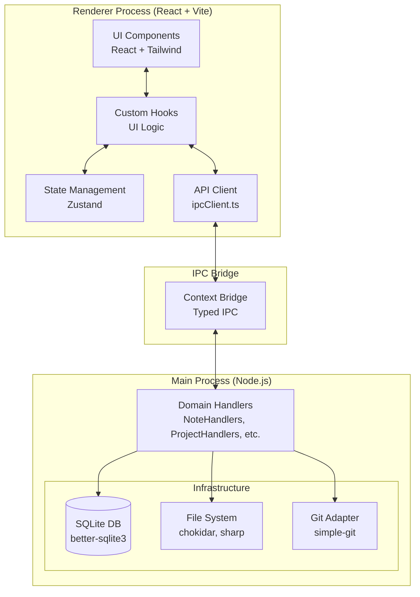

# 🧠 Memoriser (Mneme)

Memoriser is a modern, high-performance note-taking and knowledge management application built with Electron and React. Designed for students, researchers, and developers, it bridges the gap between local markdown files, Git-backed version control, and advanced AI capabilities (both local and cloud).


## ✨ Features

- **Rich Markdown Editor:** Built with CodeMirror and React, supporting KaTeX, frontmatter, and seamless image handling.
- **Local AI Inference:** Powered by `@huggingface/transformers` running in a dedicated Web Worker. Generate summaries and tags without data leaving your machine.
- **Git & GitHub Integration:** Automatically tracks your vault history. Push changes to GitHub and automatically deploy a static site using MkDocs.
- **Flashcard System:** Built-in spaced repetition system directly integrated into your notes.
- **Full-Text Search (FTS5):** Lightning-fast search across your entire vault using SQLite's FTS5 engine.
- **File System Watcher:** Real-time synchronization with your local vault directory. Edit files in any editor, and Memoriser instantly updates.
- **Privacy-First Vault:** All your notes are stored locally as plain Markdown files. You own your data.

---

## 🏗️ Architecture

Memoriser uses a modern Electron stack, treating the Main process as a robust backend (Hexagonal Architecture) and the Renderer as a lightweight, reactive frontend.



### Key Components

1. **Frontend (Renderer):** 
   - **React & TailwindCSS** for a responsive, accessible UI.
   - **Central Typed API Client:** All backend calls are neatly wrapped in `src/api/ipcClient.ts`.
   - **Zustand** manages global UI and domain state.
   - **Web Workers** run `@huggingface/transformers` to offload heavy AI computation from the main UI thread.

2. **Backend (Main):**
   - **Domain Handlers:** A modular architecture where logic is grouped into focused handlers (e.g., `NoteHandlers.ts`, `ProjectHandlers.ts`), keeping the backend intuitive and easy to debug.
   - **Better-SQLite3:** Provides a robust local database for metadata, FTS5 search indexing, and flashcard scheduling.
   - **Chokidar:** Watches the local vault directory for external changes and syncs the database.

3. **IPC Bridge:**
   - A strictly typed Context Bridge ensures type safety and autocompletion between the frontend and backend.

---

## 🚀 Getting Started

### Prerequisites
- Node.js (v18+)
- Python 3 (Optional, for MkDocs live preview)

### Installation

1. **Clone the repository:**
   ```bash
   git clone https://github.com/Vikramadtya/Mneme.git
   cd Mneme
   ```

2. **Install dependencies:**
   ```bash
   npm install
   ```

3. **Start the development server:**
   ```bash
   npm run dev
   # or concurrently start Vite and Electron
   npm run electron:dev
   ```

### 📦 macOS Build Process

To package the application into a standalone `.app` and a distributable `.dmg` for macOS, follow these steps:

1. **Install Prerequisites**: Ensure you have XCode Command Line Tools installed (`xcode-select --install`).
2. **Build the assets**:
   ```bash
   npm run build:mac
   ```
   This command runs `tsc -b && vite build` to compile the React application and Electron main process, and then uses `electron-builder` to package the app for macOS.
3. **Locate the Build**: The final `.dmg` and `.app` files will be placed in the `release/` directory in the root of the project.

*Note: For publishing releases directly to GitHub, you can use `npm run publish:github`. Ensure your `GH_TOKEN` environment variable is set.*

---

## 🛠️ Developer Guide (Onboarding)

### Directory Structure

- `src/` - The React Renderer application. 
  - `src/components/` - React UI components.
  - `src/application/` - Context providers and Zustand state hooks.
  - `src/api/ipcClient.ts` - Central typed IPC client for backend communication.
- `electron/` - The Node.js Main process.
  - `electron/handlers/` - Modular domain logic (NoteHandlers, ProjectHandlers, etc.).
- `docs/` - Source code for the static landing page.

### 🐛 Debugging & Logs

When troubleshooting Memoriser, you'll need to check both the Frontend (Renderer) and Backend (Main) processes:

#### Frontend (Renderer Process)
The frontend handles the React UI, state, and sending IPC messages.
- **Viewing Logs:** Open the Developer Tools inside the app by pressing `Cmd+Option+I` (or `View > Toggle Developer Tools`).
- **Debugging:** You can place `console.log()` inside your React components and view the output directly in the "Console" tab of the Developer Tools. You can also inspect the DOM and network requests here.

#### Backend (Main Process)
The backend handles the SQLite database, file system watcher, and Git integration.
- **Viewing Logs:** 
  - **In Development:** When running `npm run electron:dev`, all backend `console.log` and `console.error` outputs will appear directly in your terminal.
  - **In Production:** When running the packaged app, logs are written to the disk using `electron-log`. You can find the log files at:
    `~/Library/Logs/memoriser/main.log` (on macOS).
- **Debugging:** You can use standard `console.log` statements in any `electron/handlers/*.ts` file. 
- **Database Inspection:** The local SQLite database is stored at `~/Library/Application Support/memoriser/memoriser.db`. You can open this file with any SQLite viewer (like `sqlite3` CLI or DB Browser for SQLite) to inspect the raw tables (`projects`, `notes`, `flashcards`, etc.).

### Common Workflows

- **Adding a new DB Table:** 
  Modify `electron/db/migrations.ts` to add a new migration. Define the new TypeScript interfaces in `src/domain/models/index.ts`.
- **Adding a new IPC Call:**
  1. Define the signature in `src/types/ipc.ts`.
  2. Implement the backend handler in the appropriate domain file in `electron/handlers/` (e.g., `NoteHandlers.ts`).
  3. Add the wrapper function in `src/api/ipcClient.ts`.
- **Testing AI Features:**
  The local AI models (via Transformers.js) are downloaded on first use. Ensure you have an active internet connection the first time you generate a summary.

---

## 📄 License

MIT License. See `LICENSE` for details.
