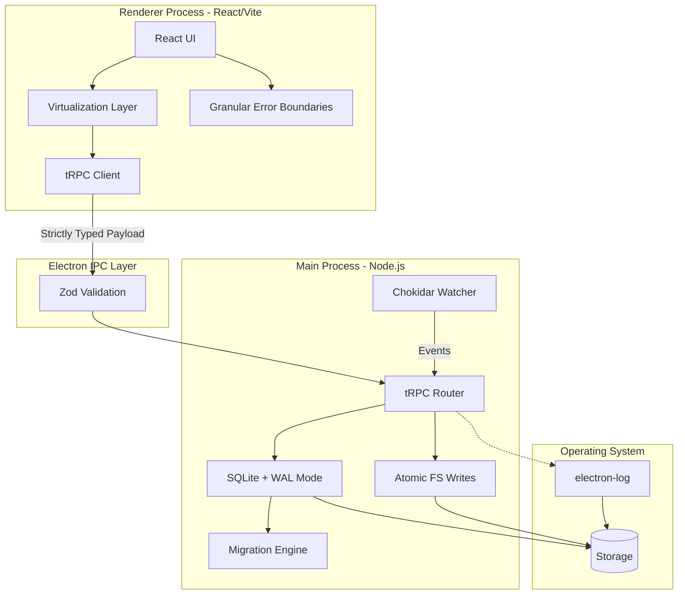

# Memoriser Architecture Improvements & Modernization Plan

This document serves as the comprehensive guide for enhancing Memoriser into a native-feeling, fast, sleek, and memory-efficient desktop application. The goal is to achieve a robust, error-free, and stable application with a zero-compromise approach to performance.

## 1. Native-Feeling Enhancements

To make Memoriser feel less like an Electron wrapper and more like a high-performance native application:

### A. Window and Frame Management
- **Vibrancy and Glassmorphism**: Utilize macOS `vibrancy` materials (e.g., `sidebar`, `popover`, `hud`) and Windows 11 `Mica` effects for translucent backgrounds. 
  - *Action*: Update `BrowserWindow` options in `electron/main.ts` with `vibrancy: 'under-window'` for macOS and `backgroundMaterial: 'mica'` for Windows.
- **Traffic Light Controls**: Perfectly align macOS window controls using `titleBarStyle: 'hiddenInset'`. Add a custom, frameless drag region across the top bar.
- **Native Context Menus**: Replace DOM-based context menus with Electron's `Menu` API (`Menu.buildFromTemplate`) which renders native OS-level menus.

### B. UI/UX Libraries & Tools
- **shadcn/ui**: Adopt `shadcn/ui` for accessible, unstyled components that we can heavily customize. This provides Radix UI primitives (Dialogs, Popovers, Dropdowns) ensuring ARIA compliance and native keyboard interactions without heavy runtimes.
- **Framer Motion**: Add micro-animations (e.g., subtle scaling on buttons, smooth drawer sliding, layout animations when deleting notes) using `framer-motion`. Limit animations to 200-300ms to preserve a snappy feel.
- **Sonner**: Use `sonner` for toast notifications. It is lightweight, supports promises, and stacks beautifully at the bottom of the screen.

## 2. Architecture & Performance Optimization

### A. Inter-Process Communication (IPC) Re-architecture
Current IPC relies on stringly-typed channels (`ipcMain.handle("db:saveNote")`). This is brittle and lacks runtime type safety.
- **tRPC over Electron IPC**: Implement `trpc-electron`. This provides end-to-end type safety between the main process (Node.js/SQLite) and the renderer (React). If the backend schema changes, the frontend will immediately show TypeScript errors.
- **Zod Validation**: Use `zod` to validate all inputs coming from the renderer before processing them in the main process. This prevents malformed data from crashing the SQLite database or corrupting the file system.

### B. File System & Disk I/O
- **Atomic Writes**: Implemented `atomicWrite.ts` which uses temporary files and OS-level renaming to guarantee file integrity even if the app crashes during a write.
- **File System Watching (Chokidar)**: Replace manual sync buttons with `chokidar` in the main process. Watch the vault directory for external Markdown file changes and auto-sync them to the SQLite index in the background using Web Workers or child processes.
- **Path Resolution Cache**: `resolveNotePath` currently calculates paths recursively on every note open/save. We must cache the directory structure in memory (`Map<string, string>`) and invalidate the cache when a file is moved. This eliminates N+1 query problems.

### C. Memory Footprint Reduction
- **Note List Virtualization**: When users have thousands of notes, rendering DOM nodes for all of them causes severe lag.
  - *Action*: Implement `@tanstack/react-virtual` for the `BooksLibrary` and `CoursesLibrary` lists. Only render the ~30 items visible in the viewport.
- **Code Splitting & Lazy Loading**: Split the React bundle using `React.lazy()`. The PDF Viewer, Settings Modal, and Knowledge Graph (D3/ReactFlow) should only load when opened.
- **V8 Snapshotting**: Pre-compile the Electron main process script using `v8-compile-cache` or Electron's snapshot API to reduce cold start times from 500ms to <100ms.

## 3. Robust Error Handling & Stability

### A. Granular Error Boundaries
Currently, a single rendering error crashes the entire `<AppProvider>` (as seen with the recent hydration mismatch).
- *Action*: Wrap critical regions (Sidebar, Note Editor, Graph View, PDF Viewer) in isolated `react-error-boundary` components. If the Graph crashes, the user can still edit notes while seeing a localized fallback UI.

### B. Structured Logging
Console logs (`console.log`) are lost when the packaged app runs.
- **electron-log**: Implement `electron-log` to write structured, rotating log files to the OS AppData directory.
- **Crash Reporting**: Integrate `@sentry/electron` to automatically capture unhandled exceptions, promise rejections, and native crashes, sending them with full stack traces and breadcrumbs.

### C. Database Stability
- **Migration System**: Implemented `migrations.ts`. Going forward, all schema changes (e.g., adding a `tags` column to flashcards) must be done through sequential up-migrations tracked in `schema_migrations`.
- **WAL Mode Optimization**: SQLite is configured in WAL (Write-Ahead Logging) mode. We must ensure a periodic `PRAGMA wal_checkpoint(TRUNCATE)` is run to prevent the WAL file from growing indefinitely.

## 4. Execution Plan (Phase 3 & 4)

### Phase 3: The Native Overhaul
1. Replace Tailwind ad-hoc classes with a strict Design System token setup (`index.css`).
2. Migrate all generic modals to `shadcn/ui` Dialogs.
3. Apply `framer-motion` `layoutId` for smooth project transitions.
4. Integrate native Window controls and Vibrancy.

### Phase 4: Extreme Performance
1. Swap `ipcMain` calls for `tRPC` router.
2. Add `@tanstack/react-virtual` to the sidebar.
3. Integrate `chokidar` for real-time vault watching.
4. Setup `electron-log` and `Sentry`.

---

